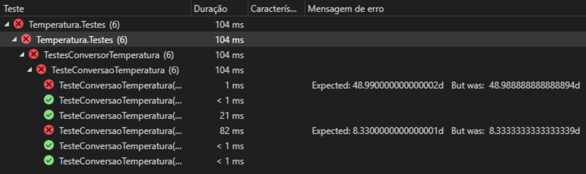
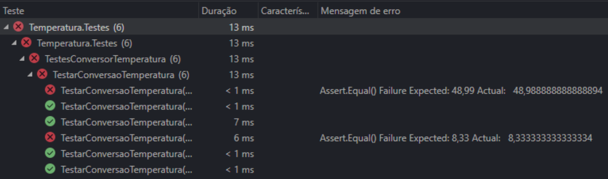
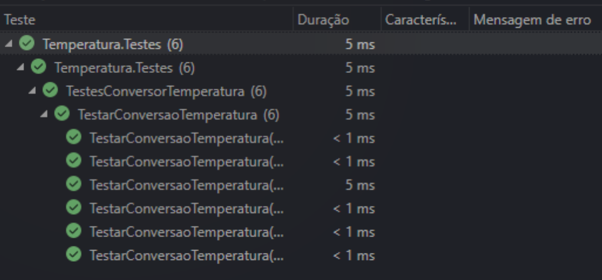
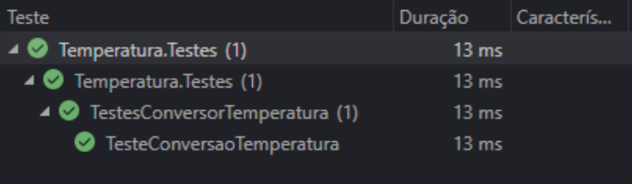
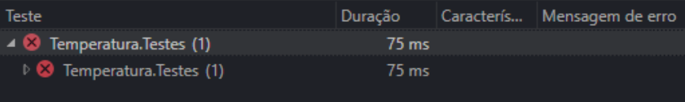

# Aplicação de Testes

Classe a ser testada:

```csharp
using System;

namespace Temperatura
{
    public static class ConversorTemperatura
    {
        public static double FahrenheitParaCelsius(double temperatura)
            //=> (temperatura - 32) / 1.8; // Simulação de falha
            => Math.Round((temperatura - 32) / 1.8, 2);
    }
}
```

## Teste Unitário com xUnit

### Introdução
Um teste unitário é uma forma de verificar a funcionalidade de componentes específicos do código, denominados unidades de trabalho. Estes testes focam exclusivamente no código sob controle do desenvolvedor, sem envolver infraestruturas externas como bancos de dados ou redes.

O xUnit é um framework popular para testes unitários em .NET, compatível com várias versões e integrável a ferramentas como o Visual Studio. Para utilizá-lo, instala-se o pacote NuGet xUnit e o runner correspondente para execução no Visual Studio.

Os testes com xUnit são organizados usando os atributos **Theory** e **InlineData**, que facilitam a realização de testes parametrizados. Isso permite testar múltiplos cenários em um único método de teste, ampliando a abrangência dos testes com eficiência.

### Códigos de Teste
Dois cenários de teste foram criados, um para sucesso e outro para falha, conforme mostrado abaixo.

```csharp
namespace Test.XUnit.Temperatura
{
    public class TestesConversorTemperatura
    {
        [Theory]
        [InlineData(32, 0)]
        [InlineData(47, 8.33)]
        [InlineData(86, 30)]
        [InlineData(90.5, 32.5)]
        [InlineData(120.18, 48.99)]
        [InlineData(212, 100)]
        public void TestarConversaoTemperatura(
            double fahrenheit, double celsius)
        {
            double valorCalculado =
                ConversorTemperatura.FahrenheitParaCelsius(fahrenheit);
            Assert.Equal(celsius, valorCalculado);
        }
    }
}
```

### Resultados dos Testes
- Teste executado com sucesso


- Teste executado sem sucesso


## Teste de Integração com NUnit

### Introdução
NUnit é um framework de teste para .NET que permite a execução isolada e automatizada de testes de código. Ele suporta testes parametrizados com o uso de atributos **TestCase**, que permitem múltiplas execuções de um mesmo teste com diferentes dados.

### Códigos de Teste
Dois cenários de teste foram preparados, incluindo um cenário de falha, com o seguinte código:

```csharp
namespace Temperatura.Testes
{
    public class TestesConversorTemperatura
    {
        [TestCase(32, 0)]
        [TestCase(47, 8.33)]
        [TestCase(86, 30)]
        [TestCase(90.5, 32.5)]
        [TestCase(120.18, 48.99)]
        [TestCase(212, 100)]
        public void TesteConversaoTemperatura(
            double tempFahrenheit, double tempCelsius)
        {
            double valorCalculado =
                ConversorTemperatura.FahrenheitParaCelsius(tempFahrenheit);
            Assert.AreEqual(tempCelsius, valorCalculado);
        }
    }
}
```

### Resultados dos Testes
- Teste executado com sucesso


- Teste executado sem sucesso


## Testes de Sistema com MSTest

### Introdução
MSTest é um framework de teste que suporta a execução isolada e automatizada de testes de código em .NET, incluindo testes de unidade básicos e parametrizados. Utiliza os atributos **DataTestMethod** e **DataRow** para testes parametrizados, permitindo múltiplas execuções de um teste com diferentes entradas.

### Códigos de Teste
O código abaixo ilustra dois cenários de teste:

```csharp
namespace Temperatura.Testes
{
    [TestClass]
    public class TestesConversorTemperatura
    {
        [DataRow(32, 0)]
        [DataRow(47, 8.33)]
        [DataRow(86, 30)]
        [DataRow(90.5, 32.

5)]
        [DataRow(120.18, 48.99)]
        [DataRow(212, 100)]
        [DataTestMethod]
        public void TesteConversaoTemperatura(
            double tempFahrenheit, double tempCelsius)
        {
            double valorCalculado =
                ConversorTemperatura.FahrenheitParaCelsius(tempFahrenheit);
            Assert.AreEqual(tempCelsius, valorCalculado);
        }
    }
}
```

### Resultados dos Testes
- Teste executado com sucesso


- Teste executado sem sucesso
